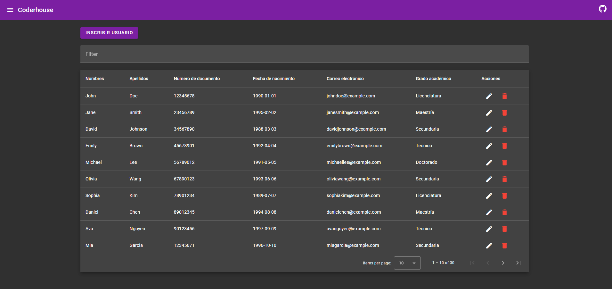
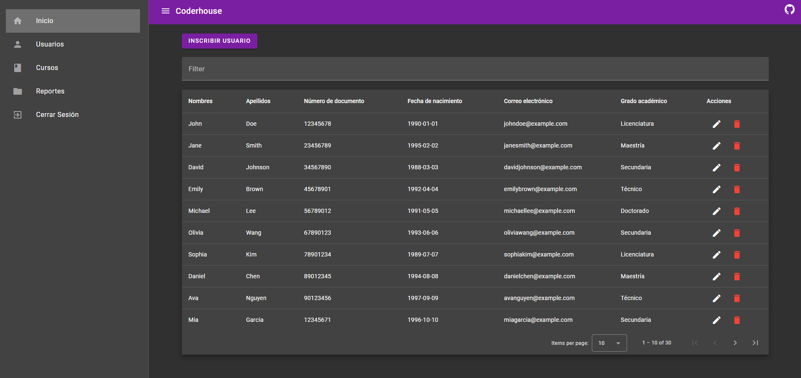
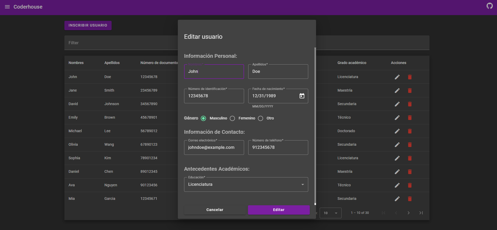
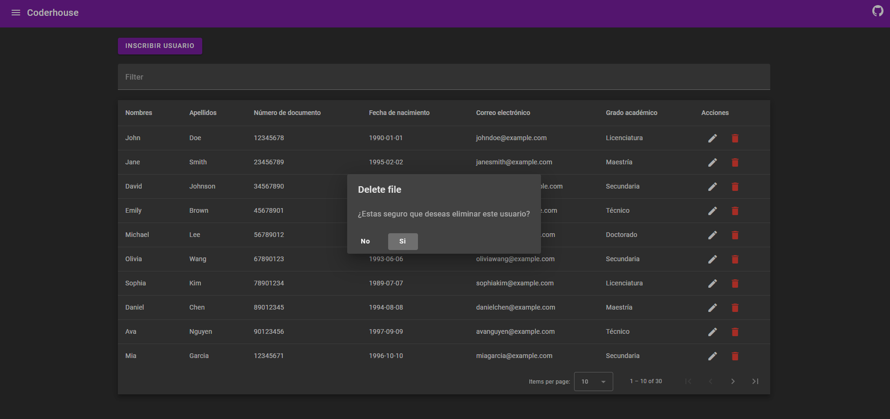

# AngularStudentManagement

This is a small example project that demonstrates how to create a CRUD (Create, Read, Update, Delete) application in Angular using Angular Material UI.

### Installation
Follow these steps to run the project on your local machine:

1. Clone this repository or download it as a ZIP file.
```
git clone git@github.com:David171901/angular-student-management.git
```
2. Navigate to the project directory.
```
cd angular-student-management
```
3. Install the frontend and backend dependencies.
```
npm install
```
4. Start the Angular application in a new terminal. This will launch the application at http://localhost:4200.
```
ng serve
```



